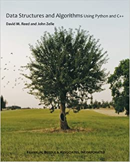

**Data Structures and Algorithms Using Python and C++**
> David M. Reed and John Zell

The Book is [available on Amazon](https://www.amazon.com/Data-Structures-Algorithms-Using-Python/dp/1590282337).

 

 **These are my own notes and implementations from working through the book.**
 - Each directory includes my notes and then the problem sets which I worked through.
 - The book starts out by assuming Python programming knowledge, and using Python to explain common algorithms and data structures. It then pickups up teaching C++ and dwelving into memory management while using Python as a pseudocode to explain.
